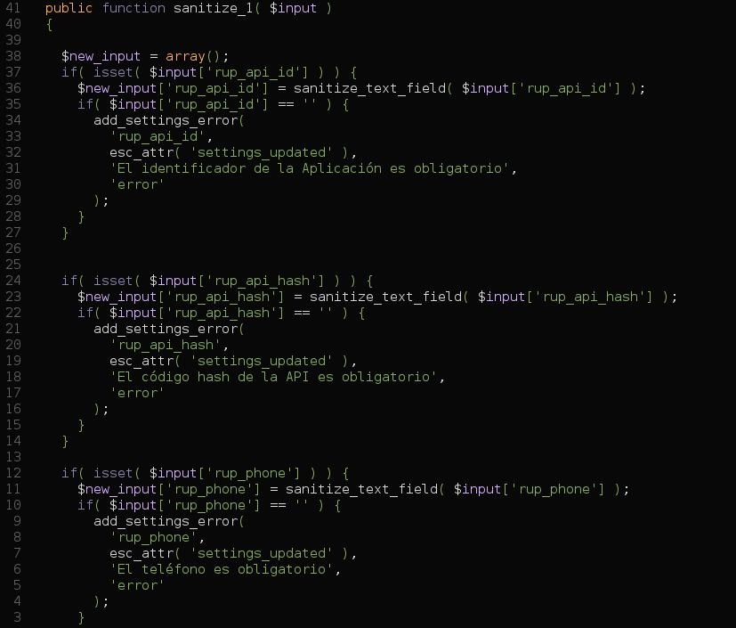
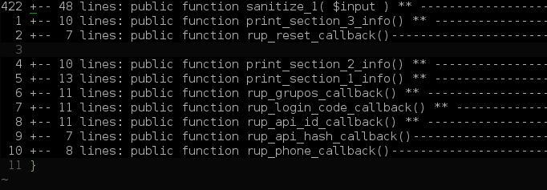

Abstract
===============

This is a fork of http://www.vim.org/scripts/script.php?script_id=1623

This script can fold PHP functions and/or classes, properties with their phpdoc
without manually adding marker style folds ({{{ and }}}). 
It will generate the following folds when executed:

```
<?php
/**
 * This is Foo...
 * @author Foo
 */
class Foo 
{
+-- 11 lines: function foo($bar) ** -------------------------------------------------
+--  8 lines: function bar($bar) ** -------------------------------------------------
+-- 24 lines: function baz($bar) ----------------------------------------------------
}
?>
```

Based on e.g. functions declared like this:

```
<?php
/**
* This is fooFunction...
*
* @param mixed $bar
* @access public
* @return void
*/
function fooFunction($bar) 
{
    ...
}
?>
```

SCREENSHOT
----------------
After you open the file all is normal:

And after you press `zm`



FEATURES
----------------
- It remembers fold settings. If you add functions and execute the script again,
  your opened folds will not be closed.
- It will not be confused by brackets in comment blocks or string literals.
- The folding of class properties with their PhpDoc comments.
- The folding of all class properties into one fold.
- Folding the original marker style folds too.
- An "**" postfixing the fold indicates PhpDoc is inside (configurable).
- An "**#@+" postfixing the fold indicates PhpDocBlock is inside (configurable).
- Empty lines postfixing the folds can be configured to be included in the fold.
- Nested folds are supported (functions inside functions, etc.)
- Folding private, public, protected class variables + multi-line param.
- Foloding the class is now an option disabled by default.
- Now works properly as ftplugin

FUTURE
----------------
- Better 'configurability' as opposed to editting the PHPCustomFolds() function
  and some "Script configuration" global variables.

CONTRIBUTE / GITHUB
----------------
- This project is hosted on github as a mirror through
 - https://github.com/vim-scripts/phpfolding.vim
- I do not own vim-scripts, so please fork mine instead:
 - https://github.com/rayburgemeestre/phpfolding.vim

It's then easier for me to accept pull requests and upload new version(s) here,
also I cannot put phpfolding.vim in the ftplugin/php directory through the
vim.org interface.


COMPATIBILITY
--------------

This script is tested successfully with Vim version >= 6.3 on windows and linux
(With 6.0 it works *sometimes*, I don't recommend using it in that version)

OPTIONS
--------

I had a hard time trying to make this plugin create the folds and maintain them
open when a file was just opened. You can use this **new** option in your .vimrc:

`let g:DisableDefaultAutoPHPFoldingBehaviour = 1`

This will set the foldings but will maintain them open when you open a file. If
you want to fold everything you can use:

`zm` in normal mode
`zn` to unfold everything again...


